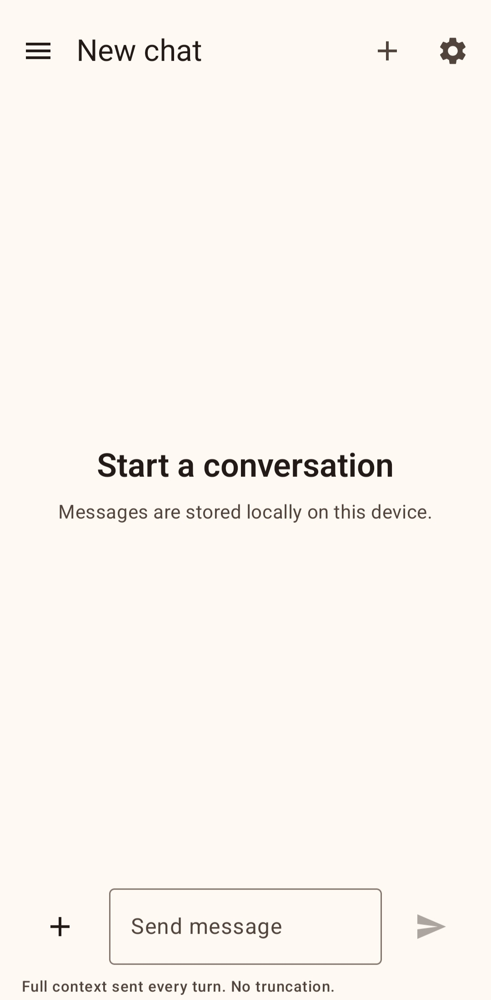
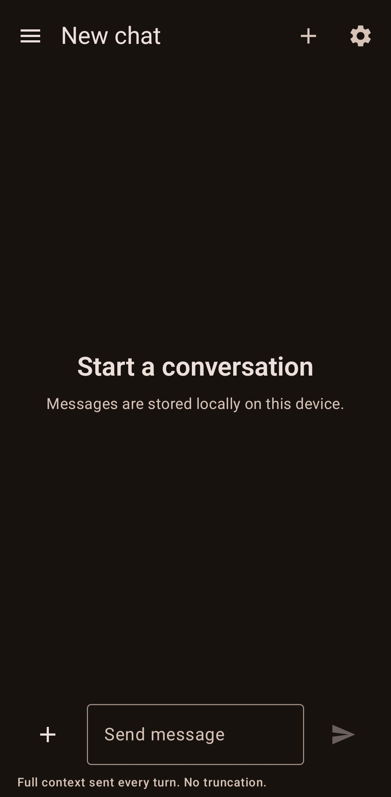
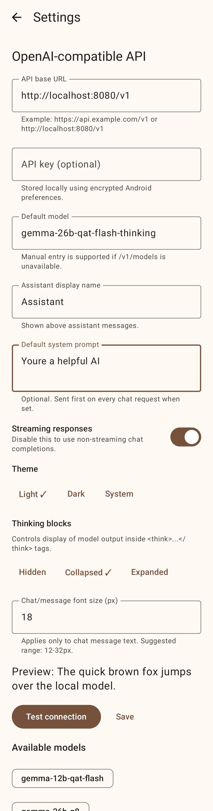
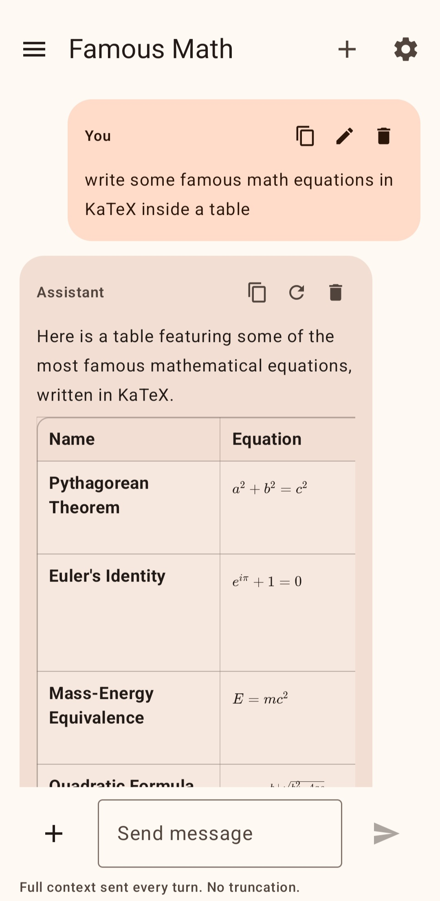
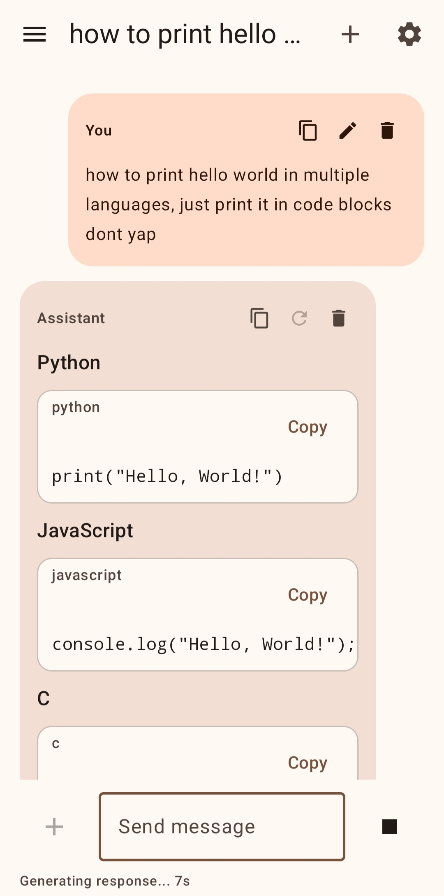
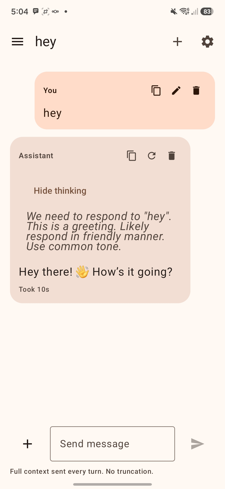

# Local AI Chat

Local AI Chat is a native Android app for talking directly to local or self-hosted OpenAI-compatible models. It is intentionally bare bones: no tools, no MCP, no sampling-control maze, just a clean chat interface pointed at your API and model weights.

## Highlights

- Native Kotlin + Jetpack Compose Android app.
- Works with OpenAI-compatible `/v1/chat/completions` APIs.
- Supports custom local, LAN, VPN, and self-hosted endpoints.
- Streams responses and keeps generation running in the background through a foreground service.
- Continues generating when the screen is off or the app is backgrounded, instead of dropping the connection like many lightweight chat clients.
- Sends full conversation context every turn by default. No silent summarization or hidden truncation.
- Supports text and vision/image messages.
- Supports Markdown, code blocks, tables, and offline KaTeX math rendering.
- Supports model reasoning/thinking blocks, including `<think>...</think>` and common `Reasoning` / `Response` formats.
- Stores chats locally on-device with Room.
- Configurable API base URL, optional API key, model name, assistant display name, theme, thinking display, and chat font size.
- Light, dark, and system theme modes.
- Search chats by title or message content.
- Rename, delete, regenerate, edit, and copy messages.

## Screenshots

| Light | Dark |
| --- | --- |
|  |  |

| Settings | Tables and Math |
| --- | --- |
|  |  |

| Code Blocks | Thinking Blocks |
| --- | --- |
|  |  |

## Download

Use the APK from the GitHub Releases page. If you are using this exported staging folder directly, the current debug APK is staged separately as:

`github/releases/Local-AI-Chat-v1.0-debug.apk`

## Setup

1. Install the APK on your Android device.
2. Open Settings.
3. Set your API base URL, for example `http://your-server:8080/v1` or `https://api.example.com/v1`.
4. Add an API key if your endpoint requires one.
5. Enter or test/select your model name.
6. Start chatting.

## Endpoint Compatibility

Local AI Chat targets OpenAI-compatible APIs. The main endpoint used for chat is:

`POST /v1/chat/completions`

Model listing uses:

`GET /v1/models`

If model listing is not available, you can manually type the model name in Settings.

## Background Generation

The app uses a foreground service and notification while responses are generating. This lets the model continue streaming/generating when:

- The app is moved to the background.
- The screen turns off.
- You switch to another app.

This is useful for local or remote models that take a long time to respond.

## Vision and Images

- Attach images from the gallery.
- Capture a photo with the camera.
- Preview images before sending.
- Tap sent images to expand and zoom.
- Images are stored locally in app-private storage.

## Markdown and Math

Supported rendering includes:

- Headings
- Bold, italic, strikethrough
- Inline code and fenced code blocks
- Copyable code blocks
- Markdown tables
- Offline KaTeX math for inline and display math
- Links
- Horizontal rules

KaTeX assets are bundled locally under `app/src/main/assets/katex`, so math rendering does not require a network connection.

## Thinking Blocks

The app can parse and display model reasoning content from:

- `<think>...</think>` tags
- `Reasoning` / `Response` style output
- Separate OpenAI-compatible reasoning fields such as `reasoning_content`

Thinking blocks can be hidden, collapsed, or expanded from Settings.

## Privacy

- Chats are stored locally on the device.
- API keys are stored using encrypted Android preferences.
- The app talks directly to the API endpoint you configure.
- No analytics or external services are included.

## Building From Source

Requirements:

- JDK 17
- Android SDK

Build debug APK:

```powershell
.\gradlew.bat assembleDebug
```

Run unit tests:

```powershell
.\gradlew.bat testDebugUnitTest
```

The debug APK will be generated at:

`app/build/outputs/apk/debug/app-debug.apk`

## Project Status

Version: `v1.0`

This app may have bugs. It was built to stay simple and focused, not to become a full agent platform.

## License

MIT. See `LICENSE`.

## Links

- GitHub: https://github.com/kerniqqi-cloud/Local-AI-chat
